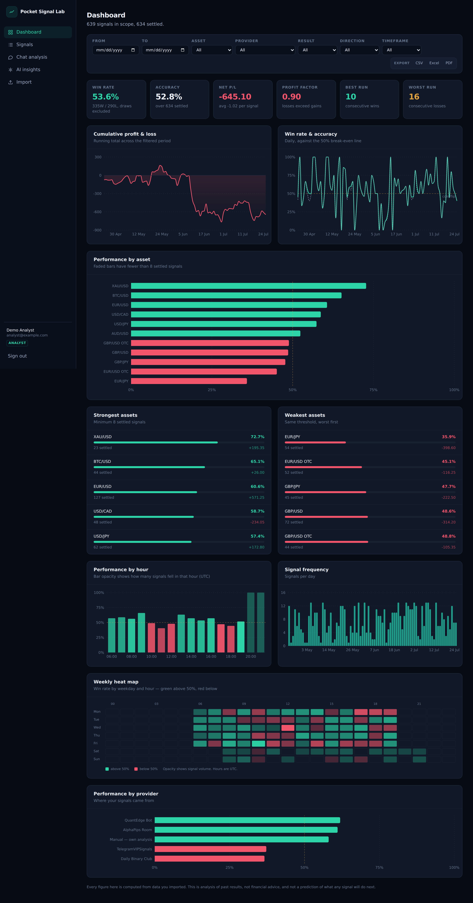

# Pocket Signal Lab

Analytics for trading chat and signal exports — **from data you already have**.

Import a signal history or a chat transcript and the app computes win rate,
accuracy, drawdown, hourly and weekly performance, sentiment over time, and
narrative findings, then exports the lot to CSV, Excel or PDF.



**[▶ Open the live demo snapshot](https://claude.ai/code/artifact/2ccf7aef-5fa5-40b5-9b5f-2b7cfec561f6)**

A browsable snapshot of the dashboard rendered from a seeded run — every figure,
chart and finding on it is genuine computed output, not mock data. It is a static
page, so sign-in, filtering, import and export are not interactive there; those
need the app running. Regenerate it any time with `npm run demo` (see
[Static demo snapshot](#static-demo-snapshot)).

---

## What this does and does not do

This is the constraint the whole design is built around:

**It reads only what you give it.** Import happens through file upload or pasted
text. There is exactly one write path into the database
(`src/lib/services/import.ts`) and it takes a string.

**It does not** log into Pocket Option, hold broker credentials, scrape
protected pages, automate a browser session, or call any private endpoint. There
is no integration to configure because there is no integration.

**It is not financial advice.** Every screen describes historical rows you
imported. Nothing predicts a price or recommends a trade, and the "AI insights"
page is explicit about the sample size behind each finding — including when that
sample is too small to mean anything.

Before importing a room's messages, check that you are permitted to keep and
process records of it.

---

## Features

**Dashboard** — win rate, accuracy, net P/L, profit factor, best/worst streaks;
equity curve; win rate vs. the 50% break-even line; per-asset, per-hour and
per-provider breakdowns; signal-frequency histogram; weekday × hour heat map.

**Signals** — the full log, filterable and paginated, with the outcome recorded
in your source data.

**Chat analysis** — per-message sentiment scoring with negation and intensifier
handling, asset and strategy detection, promotional-message flagging, duplicate
detection, and sentiment plotted over time.

**AI insights** — trend, risk, pattern and sentiment findings with confidence
scores, a composite risk assessment, and data-quality recommendations.
Optionally rephrased by OpenAI; fully functional without a key.

**Filtering** — date range, asset, provider, result, direction, timeframe,
channel, sentiment. Filters live in the URL, so a filtered view is shareable and
feeds straight into the export endpoints.

**Export** — CSV, Excel (`.xlsx`, multi-sheet, formatted) and PDF (paginated,
typeset). All three render the same report model, so they cannot disagree.

**Auth** — email/password with bcrypt (cost 12), JWT sessions in `httpOnly`
cookies via `jose`, and three roles: `ADMIN`, `ANALYST`, `VIEWER` (read-only).

---

## Stack

| Layer      | Choice                                          |
| ---------- | ----------------------------------------------- |
| Framework  | Next.js 16 (App Router), React 19               |
| Language   | TypeScript 7 (strict)                           |
| Styling    | Tailwind CSS 4                                  |
| Database   | PostgreSQL 16 + Prisma 7 (`@prisma/adapter-pg`) |
| Charts     | Recharts 3                                      |
| Auth       | `jose` (JWT) + `bcryptjs`                       |
| Export     | `exceljs`, `pdf-lib`                            |
| Validation | Zod 4                                           |
| AI         | OpenAI HTTP API — **optional**                  |

Backend and frontend are one Next.js app: route handlers under `src/app/api` are
the Node service layer, and server components call the same service modules
directly rather than round-tripping through HTTP.

---

## Quick start

Requires Node 20+ and PostgreSQL 16+.

```bash
git clone <this-repo> && cd pocket-signal-lab
npm install

cp .env.example .env
# Set DATABASE_URL, and generate AUTH_SECRET with: openssl rand -base64 48

npm run db:migrate     # create the schema
npm run samples        # generate the sample dataset
npm run db:seed        # create demo users and import the samples

npm run dev            # http://localhost:3000
```

Sign in as `analyst@example.com` / `analyst12345` for the seeded dataset, or
`viewer@example.com` / `viewer12345` to see the read-only role.

Prefer Docker for the database:

```bash
docker compose up -d db
```

Full instructions, including the production path, are in
[docs/INSTALL.md](docs/INSTALL.md).

---

## Scripts

| Command              | Does                                            |
| -------------------- | ----------------------------------------------- |
| `npm run dev`        | Dev server                                      |
| `npm run build`      | `prisma generate` + production build            |
| `npm start`          | Serve the production build                      |
| `npm run typecheck`  | `tsc --noEmit`                                  |
| `npm run samples`    | Regenerate `samples/` (deterministic)           |
| `npm run demo`       | Build `demo.html` from a running instance       |
| `npm run db:migrate` | Create and apply a migration                    |
| `npm run db:deploy`  | Apply migrations without prompting (production) |
| `npm run db:seed`    | Seed demo users and import the sample dataset   |
| `npm run db:studio`  | Prisma Studio                                   |
| `npm run db:reset`   | Drop, re-migrate and re-seed                    |

---

## Sample dataset

`npm run samples` writes four files to `samples/`, generated from a fixed seed so
every checkout gets identical data:

| File              | Contents                                                         |
| ----------------- | ---------------------------------------------------------------- |
| `signals.csv`     | 639 signals over 92 days, **plus 3 deliberately malformed rows**  |
| `signals.json`    | 120 signals using entirely different column names                 |
| `chat-export.txt` | ~1,450 messages in `[timestamp] author: message` format           |
| `chat-export.csv` | 400 messages in tabular form                                      |

It is shaped to exercise the analysis rather than flatter it: assets genuinely
differ in edge, one provider is markedly worse than the others, there is a real
six-day slump producing a 16-signal losing streak, ~5% of chat is promotional
spam, and some messages repeat so duplicate detection has something to catch.
The malformed rows exist so the importer's rejection reporting is visible on the
sample data rather than only in theory.

The seed imports these through the real import service, so a broken parser fails
the seed instead of the two drifting apart.

---

## Static demo snapshot

The app needs a Node server and PostgreSQL, so it cannot be hosted as a static
page. `scripts/build-demo.mjs` bridges that: it pulls the four analytics
endpoints from a running instance and bakes the results into a single
self-contained HTML file with hand-written SVG charts.

```bash
npm run dev      # in one terminal
npm run demo     # in another — writes demo.html
```

Point it somewhere else, or rebuild from saved JSON:

```bash
node scripts/build-demo.mjs https://analytics.example.com out.html
node scripts/build-demo.mjs ./saved-json out.html
```

It signs in with the seeded analyst credentials, overridable via
`SEED_ANALYST_EMAIL` and `SEED_ANALYST_PASSWORD`.

The output carries real computed figures, not mock data — but it is a snapshot,
and the page says so in a banner. Sign-in, filtering, import and CSV/Excel/PDF
export are live server features and are inert in the static file.

The hosted copy linked at the top of this README is private to its owner until
shared. If you need a link others can open, generate your own `demo.html` and
host it anywhere that serves static files.

---

## Documentation

| Document                                | Covers                                         |
| --------------------------------------- | ---------------------------------------------- |
| [INSTALL.md](docs/INSTALL.md)           | Setup, environment variables, troubleshooting  |
| [API.md](docs/API.md)                   | Every endpoint, with request/response examples |
| [ARCHITECTURE.md](docs/ARCHITECTURE.md) | Folder layout, data model, how analysis works  |
| [DEPLOYMENT.md](docs/DEPLOYMENT.md)     | Vercel, Docker, and self-hosted deployment     |
| [MAINTENANCE.md](docs/MAINTENANCE.md)   | Extending the analysis, migrations, upkeep     |

---

## Licence

Apache-2.0. See [LICENSE](LICENSE).

Trading binary options carries a substantial risk of losing your capital. This
software analyses historical records and does not provide financial advice.
